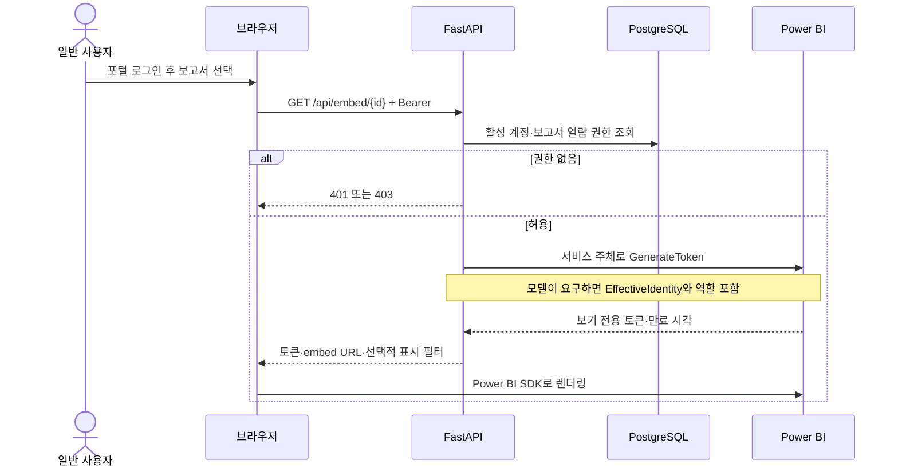
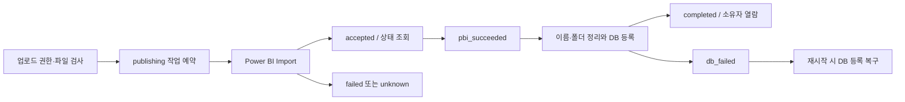

# DB와 API 흐름

## 일반 사용자 요청



토큰 캐시는 `(report_id, pbi_username)`별입니다. 같은 키에 대한 동시 발급은 잠금으로 합쳐집니다. 다른 사용자는 별도의 키를 사용합니다. 캐시 적중 여부와 무관하게 API는 계정·보고서 권한을 다시 확인합니다. 권한 회수는 이미 발급된 Power BI 토큰 자체를 폐기하지 않습니다.

## 테이블

| 테이블 | 용도 |
|---|---|
| users | 비밀번호 해시, 활성/관리자/업로드 플래그, 부서, SSO 이메일, RLS 신원 |
| reports | 보고서·모델·워크스페이스 연결, 소유자, 공개 범위, 상태, 표시 필터 |
| report_folders | Fabric 폴더 구조의 포털 표현 |
| user_reports | 개인 허용/명시적 차단. 행 없음은 개인 설정 없음 |
| department_report_access | 부서별 보고서 허용 |
| upload_jobs | 업로드·재시작 복구 상태 |
| user_report_marks | 즐겨찾기·최근 본 보고서 |
| event_log | 현재 로그인 이력 저장. 활동/감사 유형은 과거 구조가 남음 |
| app_config | 과거 호환 테이블. 현재 코드에서 읽지 않음 |

users.email 및 부분 유니크 인덱스는 init_schema.py에 포함됩니다. app_config와 과거 구조는 데이터 보존을 위해 자동 삭제하지 않습니다. 신규 초기화 스키마는 9개 테이블입니다.

## 열람 판정

`database/reports.py::_CAN_VIEW_REPORT_SQL`의 조건은 다음과 같습니다.

```text
개별 차단 없음 AND (본인 소유 OR shared OR 개인 허용 OR 부서 허용)
```

활성 여부는 호출 쿼리에서 검사합니다. 관리자는 활성 보고서 전체를 열람합니다. 관리자 사용자별 보고서 목록과 보고서별 권한 화면도 같은 판정을 사용합니다. 폴더는 정리·탐색 기준이며 보고서 권한을 대신하지 않습니다.

## API 역할

| 경로 | 권한·역할 |
|---|---|
| /login, /login/sso, /auth/callback | 로그인·SSO |
| /help | 로그인 전에도 볼 수 있는 공통 열람 안내 |
| /, /api/bootstrap | 인증된 사용자 포털 |
| /api/embed/{id} | 인증 + 보고서 열람권한 |
| /api/favorites/{id}, /api/recents/{id} | 인증 + CSRF 또는 Bearer + 보고서 권한 |
| /api/upload | 인증 + 업로드 권한 + CSRF 또는 Bearer |
| /api/upload/status/{id} | 작업 소유자 |
| /api/report-folders | 인증된 사용자에게 허용된 보고서의 폴더 |
| /admin, /api/admin/*, /docs | 관리자 |
| /health | 앱·DB 상태만 확인 |
| /openapi.json | API 명세. 대화형 Swagger/ReDoc UI는 비활성 |

개인·부서 권한 변경의 can_view는 JSON boolean만 허용합니다. 문자열 "false"를 true로 처리하지 않습니다.

## 업로드



신규 업로드는 비공개입니다. 같은 파일명은 충돌 처리합니다. 콘텐츠 업데이트·내보내기 기능은 현재 없습니다. 불확실한 게시 결과는 같은 이름 재업로드를 차단하고 운영자가 확인해야 합니다.

현재 업로드는 최대 1GB 파일을 메모리에 읽고 프로세스 내부 작업으로 게시합니다. 동시 업로드가 많으면 메모리와 작업 복구의 한계가 있으므로 실제 부하를 확인해야 합니다.

보고서 삭제는 Power BI 보고서와 포털 상태에 반영됩니다. 모델은 다른 보고서·타일에서 사용할 수 있어 자동 삭제하지 않습니다.
