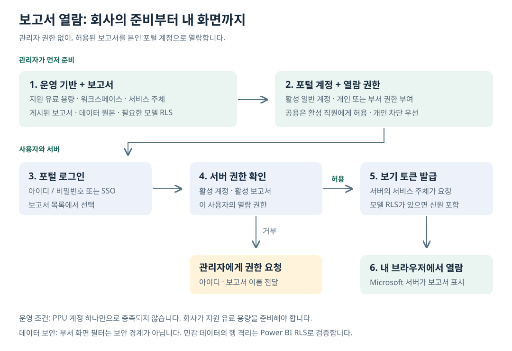

# 일반 사용자가 보고서를 보기 위한 가이드

포털 관리자 권한은 필요 없습니다. **회사 운영 기반 + 활성 포털 계정 + 보고서 열람 권한**이 준비되어야 합니다.

포털에서는 로그인 화면의 “보고서 열람 안내”, 로그인 후 상단 “열람 안내”, 또는 /help에서 같은 안내를 볼 수 있습니다.

## 관리자가 먼저 준비할 것

| 준비 항목 | 완료 기준 |
|---|---|
| 서비스 주체 | Entra 앱 자격 증명, 테넌트 API·임베딩 허용, 보고서·의미 모델 워크스페이스 Member/Admin |
| 운영 용량 | 지원 유료 용량 배정·활성화. PPU/PP3 단독 불충족 |
| 보고서 | 개인 My workspace가 아닌 대상 워크스페이스에 게시, 포털 가져오기 완료, active 상태 |
| 데이터 | 데이터 원본 자격 증명·필요한 게이트웨이·새로고침 정상. 민감 행은 모델 RLS 검증 |
| 포털 접속 | HTTPS 주소, 필요한 사내망/VPN, 브라우저 Microsoft 렌더링 통신 허용 |
| 계정 | /admin → 사용자 → 사용자 추가, 일반 사용자로 생성·활성화 |
| 로그인 방식 | 포털 아이디/비밀번호, 또는 Microsoft 계정을 기존 포털 이메일에 연결 |
| 보고서 권한 | /admin → 보고서 → 권한 → 개인 허용 또는 정확히 일치하는 부서에 허용 |

등록한 보고서는 처음부터 전 직원에게 공개되지 않습니다. “포털 공용(shared)” 전환은 모든 활성 일반 사용자에게 열람을 허용하므로 필요한 경우에만 설정합니다. 개인 차단이 있으면 공용·부서 허용보다 우선합니다.

## 직원이 하는 일

1. 안내받은 회사 주소로 접속합니다. 사내 전용 주소면 VPN 또는 회사 네트워크를 사용합니다.
2. 아이디/비밀번호 또는 회사가 연결한 Microsoft 계정으로 로그인합니다.
3. “보고서” 메뉴에서 폴더를 펼치거나 제목을 검색합니다.
4. 보고서를 선택하여 열람합니다. Power BI 계정 로그인 창을 별도로 열 필요는 없습니다.

Microsoft 계정 자체가 없는 직원도 포털 비밀번호 방식으로 로그인할 수 있습니다. 회사가 유효한 App-Owns-Data 운영 용량을 준비한 경우 포털 임베드 열람자에게 개인 Power BI 라이선스는 필요하지 않습니다. [Microsoft 설명](https://learn.microsoft.com/en-us/power-bi/developer/embedded/embedded-analytics-power-bi)

SSO는 자동 회원가입이 아닙니다. Microsoft 인증 후 이메일이 기존 활성 포털 계정과 일치해야 합니다. Entra에서 이 앱에 사용자 배정을 요구하면 해당 배정도 필요합니다.

## 어떤 권한이 필요한가

| 권한 | 일반 열람 직원 |
|---|---|
| 활성 포털 계정 | 필요 |
| 대상 보고서 열람권한 | 필요. 소유자·공용·개인·부서 경로 중 하나, 명시적 개인 차단 없음 |
| 포털 관리자 권한 | 불필요 |
| PBIX 업로드 권한 | 열람에는 불필요 |
| Power BI 워크스페이스 구성원 | 포털 임베드 열람에는 불필요 |
| Microsoft 로그인 계정 | SSO 방식 선택 시 필요 |
| 개인 Power BI 라이선스 | 적합한 App-Owns-Data 운영 용량에서 포털만 열람하면 불필요 |

## 잘못 이해하기 쉬운 점

- 부서만 입력하면 모든 보고서가 자동 허용되는 것은 아닙니다. 해당 부서에 보고서를 허용해야 합니다.
- 부서 변경은 열람권한과 기본 표시 필터 모두에 영향을 줄 수 있습니다.
- 부서 값 ALL은 표시 필터를 생략하는 값이며 모든 보고서의 열람 권한을 부여하지 않습니다.
- 빈 부서는 표시 필터를 생략합니다. 민감 데이터를 보호하는 설정으로 사용하지 않습니다.
- 포털에서 관리자인 것과 모델 RLS에서 전체 행을 보는 것은 별개입니다.
- 퇴사자 비활성화는 다음 포털 요청부터 반영됩니다. 이미 발급된 임베드 토큰의 잔여 유효기간은 따로 있습니다.

## 문제가 생겼을 때

| 증상 | 사용자 조치 | 관리자 확인 |
|---|---|---|
| 로그인 실패 | 안내받은 방식 확인 | 활성 여부, 비밀번호 차단, SSO 이메일·앱 배정 |
| 목록 없음 | 보고서 이름과 아이디 전달 | active 상태, 개인 차단, 개인/부서/공용 권한 |
| 목록은 있으나 열리지 않음 | 시각·오류 문구 전달 | 용량, 서비스 주체, 모델·네트워크 |
| 빈 화면 / 오래된 수치 | 보고서와 시각 전달 | 필터 값, RLS 매핑, 새로고침 |
| 타 부서 민감 데이터 노출 | 추가 공유 없이 즉시 신고 | 화면 필터가 아닌 모델 RLS 확인 |

비밀번호·시크릿·임베드 토큰은 문의 자료에 포함하지 않습니다.
