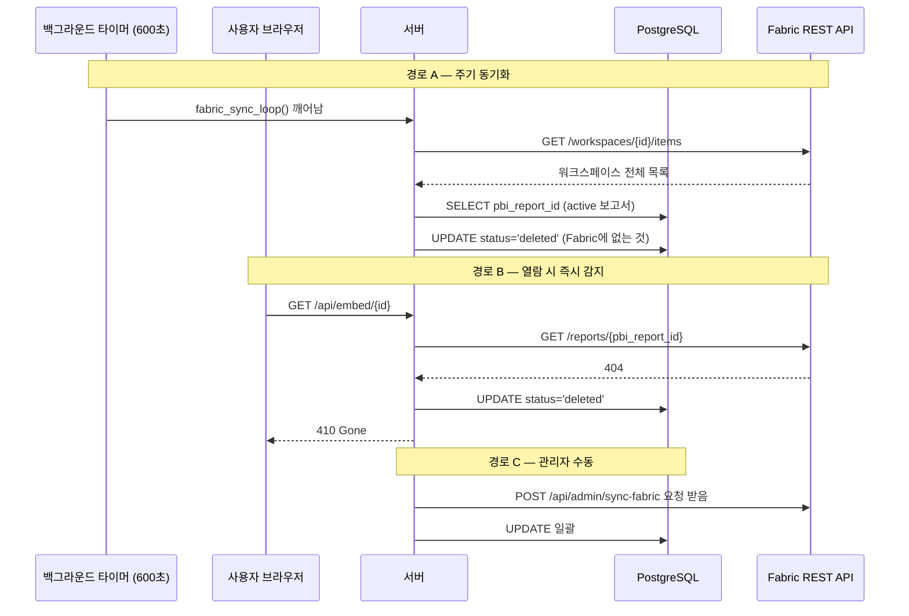
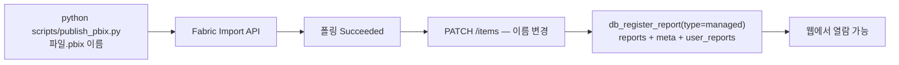
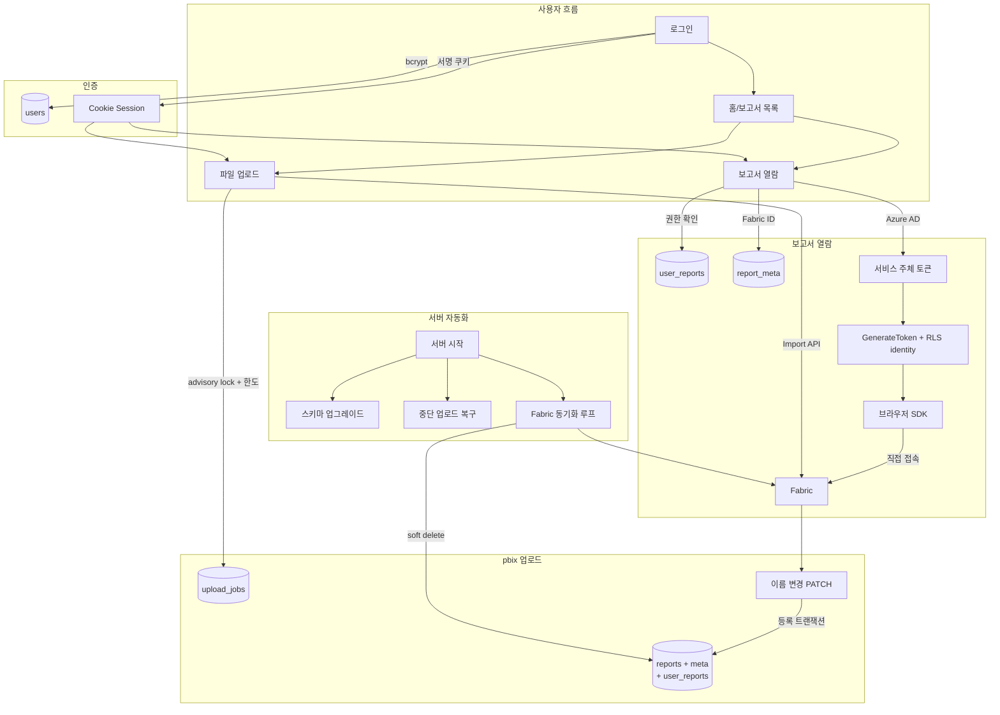

# 요청 흐름 — 보고서 열람 · 업로드 · 서버 자동화

---

## 흐름 1. 보고서 열람 (RLS 포함)

### 로그인

```
브라우저 → POST /login → 서버
  서버: verify_csrf → db_login_allowed (15분 5회 실패 시 차단)
      → db_authenticate (SELECT users WHERE username=? / bcrypt 검증)
      → db_record_login
  → 세션 쿠키 발급 ({"username": "user01"} 서명, 8시간)
```

비밀번호 비교는 **서버 파이썬에서** 한다. DB에는 bcrypt 해시만 있다.  
세션은 서버에 저장되지 않는다 — 서명된 쿠키로만 존재한다.

### 사이드바 — 내 보고서만 나오는 이유

`GET /` 시 `db_get_reports("user01")`이 실행:

```sql
SELECT r.id, r.name, ...
FROM user_reports ur
JOIN reports r     ON r.id = ur.report_id
JOIN report_meta m ON m.report_id = r.id
WHERE ur.user_id = (SELECT id FROM users WHERE username='user01')
  AND ur.can_view = TRUE
  AND r.status = 'active'
ORDER BY r.id;
```

`user_reports`에 없는 보고서는 응답에 아예 없다 — 숨긴 게 아니라 존재 자체를 모른다.

### 임베드 토큰 발급 (`GET /api/embed/{id}`)

| 단계 | 대상 | 내용 |
|---|---|---|
| ① 세션 확인 | 쿠키 | 서명 검증 → username → `db_get_user()` |
| ② 권한 확인 | PostgreSQL | `db_get_reports()` — 목록에 없으면 403 |
| ③ 보고서 조회 | PostgreSQL | reports + report_meta + settings + rls 조인 |
| ④ 서비스 토큰 | Azure AD | `get_access_token()` (캐시 ~1시간) |
| ⑤ 보고서 정보 | Fabric API | `GET /reports/{pbi_report_id}`. **404면 DB도 즉시 deleted** |
| ⑥ 토큰 발급 | Power BI API | `GenerateToken` — RLS identity 첨부 |
| ⑦ 응답 | 브라우저 | 토큰 + embedUrl + 화면설정 |

### RLS — "누구로 보이는가"

GenerateToken에 전달되는 identity:

```json
{
  "username": "user01@qualisoft.co.kr",  ← users.pbi_username
  "roles":    ["도메인"],                 ← report_rls.role_names 또는 users.roles
  "datasets": ["<dataset-id>"]
}
```

Fabric의 DAX 필터(`[사번] = USERNAME()` 등)가 이 identity로 행을 거른다.  
**서버는 identity를 전달할 뿐 — 필터링 자체는 Fabric이 한다.**

### 렌더링

브라우저의 powerbi-client SDK가 토큰 + embedUrl로 Fabric에 직접 접속해 그린다.  
서버는 더 이상 관여하지 않는다. 토큰 만료(~1시간) 후 새로고침하면 재발급한다.

---

## 흐름 2. .pbix 업로드

### 핵심 원칙: "DB 먼저, Fabric은 그다음"

도중에 서버가 죽어도 같은 파일이 Fabric에 두 번 게시되지 않도록  
**모든 단계 전후에 `upload_jobs.status`를 갱신**하며 진행한다.

### 단계별 흐름

```
브라우저 → POST /api/upload → 서버

[검증]   .pbix 확장자, ZIP 서명(PK\x03\x04), ≤1GB, 이름 1~50자
[A] db_reserve_upload()          → INSERT upload_jobs (status=publishing)
                                   advisory_lock(user_id): 동시 업로드 직렬화
                                   한도 검사: 하루 10회, 개인 보고서 20개
[B] fabric_get_or_create_folder() → 사용자 폴더 확보 (없으면 생성)
[C] POST /imports                 → 내부이름(사용자__이름__uuid)으로 게시
                                   status = accepted
[D] 3초 간격 폴링 (최대 5분)      → Fabric이 .pbix를 보고서+의미모델로 변환
[E] fabric_rename_new_items()     → 내부이름 → 원래 이름으로 PATCH
    └── 409 이름 충돌              → fabric_delete_items() 롤백 (방금 올린 항목만 삭제)
                                   status = conflict / 사용자에게 에러 반환
                                   status = fabric_succeeded
[F] db_register_report()          → 한 트랜잭션: reports + meta + settings + rls
                                   + user_reports(본인 + 모든 관리자)
                                   + audit_log
                                   status = completed
```

**내부 이름에 uuid를 붙이는 이유**: Fabric의 이름 충돌 검사는 워크스페이스 전체 기준.  
일회성 유일 이름으로 올린 뒤 이름을 복원하면 서로 다른 사용자가 같은 이름을 쓸 수 있다.

**`nameConflict=Abort`를 쓰는 이유**: 만에 하나 충돌해도 기존 항목을 덮어쓰지 않는다.

### 업로드 실패 상태

| status | 원인 | 복구 |
|---|---|---|
| `failed` | 검증 실패 또는 Fabric 에러 | 같은 이름으로 재시도 가능 |
| `conflict` | Fabric 이름 충돌 (409) | 다른 이름으로 재시도 |
| `unknown` | Fabric에 만들어졌는지 불확실 | 관리자가 Fabric 확인 후 정리. 그때까지 같은 이름 차단 |
| `accepted` 정지 | 폴링 중 서버 다운 | **서버 재시작 시 자동**: Import 상태 재조회 후 이어서 진행 |
| `db_failed` | Fabric 성공, DB 등록만 실패 | **서버 재시작 시 자동**: DB 등록 재시도 |

---

## 흐름 3. 서버 시작 자동화

```mermaid
flowchart TD
    A[uvicorn 시작] --> B[migrate_report_meta.py\n스키마 자동 업그레이드]
    B --> C[db_pool 커넥션 풀 생성\n2~20 connections]
    C --> D[recover_pending_imports\n중단된 upload_jobs 복구]
    D --> D1{accepted 또는\nfabric_succeeded 행?}
    D1 -->|있음| D2[Fabric Import API 재조회\n완료됐으면 DB 등록까지 마무리]
    D1 -->|없음| E
    D2 --> E[fabric_sync_loop 백그라운드 시작\n600초 주기]
    E --> F[/health 200 응답]
```

---

## 흐름 4. Fabric 삭제 동기화



소프트 삭제만 한다 — 물리 삭제 시 권한·감사 이력이 사라지므로.  
Azure 장애 시 목록 조회 실패 → 그 회차 건너뜀 (전체 삭제 사고 방지).

---

## 흐름 5. 관리자 CLI 게시 (`publish_pbix.py`)



`upload_jobs`를 거치지 않고 스크립트 한 번 실행으로 끝난다.  
완료 후 출력되는 SQL로 권한을 직접 부여한다.

---

## 전체 조감도


